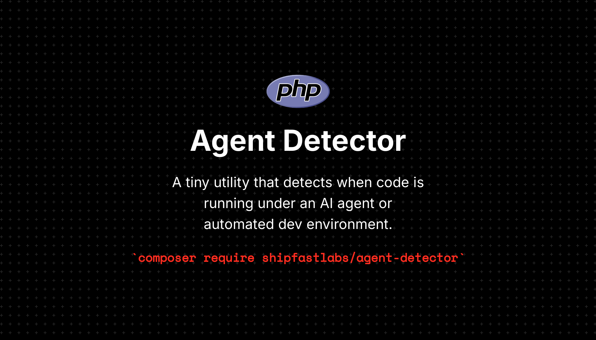

<p align="center">
    
    <p align="center">
        <a href="https://github.com/shipfastlabs/agent-detector/actions"></a>
        <a href="https://packagist.org/packages/shipfastlabs/agent-detector"></a>
        <a href="https://packagist.org/packages/shipfastlabs/agent-detector"></a>
        <a href="https://packagist.org/packages/shipfastlabs/agent-detector"></a>
    </p>
</p>

------

A lightweight PHP utility to detect if your code is running inside an AI agent or automated development environment.

> **Requires [PHP 8.2+](https://php.net/releases/)**

## Installation

```bash
composer require shipfastlabs/agent-detector
```

## Usage

```php
use AgentDetector\AgentDetector;

$result = AgentDetector::detect();

if ($result->isAgent) {
    echo "Running inside: {$result->name}";
}

// Check for a specific known agent
if ($result->knownAgent() === \AgentDetector\KnownAgent::Claude) {
    echo "Hello from Claude!";
}
```

Or use the standalone function:

```php
use function AgentDetector\detectAgent;

$result = detectAgent();
```

## Supported Agents

| Agent | Detection Method |
|-------|-----------------|
| Custom | `AI_AGENT` env var |
| Cursor | `CURSOR_TRACE_ID` env var |
| Cursor CLI | `CURSOR_AGENT` env var |
| Gemini | `GEMINI_CLI` env var |
| Codex | `CODEX_SANDBOX` env var |
| Augment CLI | `AUGMENT_AGENT` env var |
| Opencode | `OPENCODE_CLIENT` or `OPENCODE` env var |
| Claude | `CLAUDECODE` or `CLAUDE_CODE` env var |
| Replit | `REPL_ID` env var |
| Devin | `/opt/.devin` file exists |

### Custom Agent

Set the `AI_AGENT` environment variable to any value to identify your custom agent:

```bash
AI_AGENT=my-custom-agent php your-script.php
```

## Contributing

Please see [CONTRIBUTING](CONTRIBUTING.md) for details on how to contribute, including adding support for new agents.

## Testing

```bash
composer test
```

**Agent Detector** was created by **[Pushpak Chhajed](https://github.com/pushpak1300)** under the **[MIT license](https://opensource.org/licenses/MIT)**.
